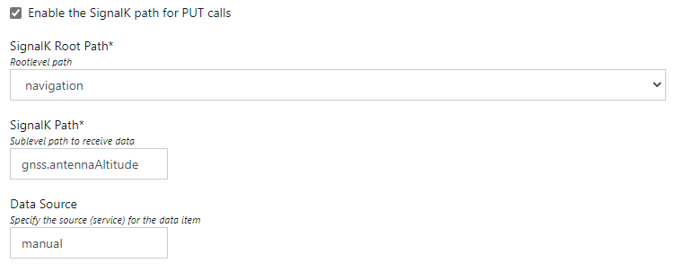
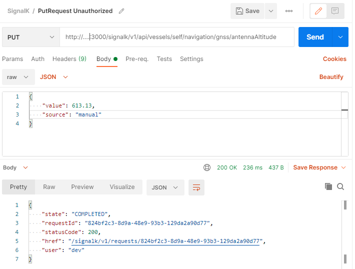

# signalk-rest-connector-plugin
SignalK plugin to receive selected deltas via REST PUT requests 

## Install & Use
Install the plugin through the SignalK plugin interface. After installation you need to 'Activate' it through the SignalK Plugin Config interface and configure the number of put handlers the plugin shall listen on. The plugin will inject new SignalK-values, eg.: 

<code>'navigation.gnss.antennaAltitude'  </code> 

by configuring like 
</img> 
 
Sending a put request requires authorization first and a proper JSON object to be submitted in the body specifying at least the data source as well as the value to be captured. This can be done even manually through POSTMAN - yet the data source specified needs to match the configuration: 
</img> 
 
Each path can be selectively enabled or disabled. 
